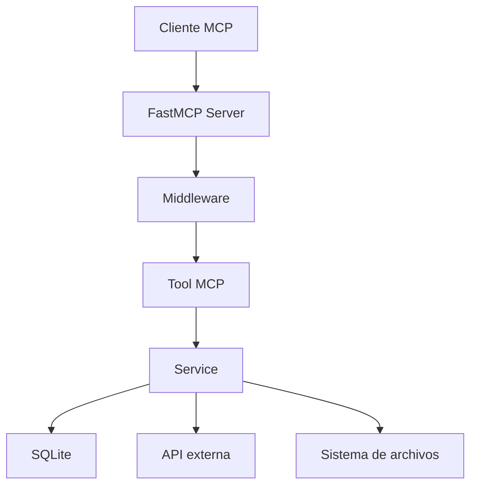

# MCP Logging and Progress Demo

A demonstration of the Model Context Protocol using a STDIO transport with production-grade observability via Langfuse tracing.

## Quick Start

### Setup

Install dependencies using uv:

```bash
uv sync
```

### Configuration

Create or update your `.env` file with Langfuse credentials:

```bash
# Langfuse Tracing
LANGFUSE_SECRET_KEY="sk-lf-..."
LANGFUSE_PUBLIC_KEY="pk-lf-..."
LANGFUSE_BASE_URL="https://cloud.langfuse.com"

# MCP Server
TRANSPORT=streamable-http
HOST=127.0.0.1
PORT=8000
MCP_API_KEY=your-api-key
DB_PATH="test-runtime.db"
```

Get your Langfuse credentials from [Langfuse Cloud](https://cloud.langfuse.com/) or self-hosted instance.

## Running the Project

Run the MCP client:

```bash
uv run client.py
```

Run the MCP server:

```bash
uv run server.py
```

## Observability & Tracing

This project includes **production-grade distributed tracing** via Langfuse. Every MCP tool call, service method, and database operation is automatically traced.

### Key Features

- ✅ **Automatic Tool Tracing**: Every MCP tool call is traced with timing and errors
- ✅ **Service-Level Observability**: Track database operations and API calls
- ✅ **Middleware Integration**: Protocol-level tracing without code changes
- ✅ **Error Tracking**: Detailed error context and stack traces
- ✅ **Performance Monitoring**: Latency metrics for all operations
- ✅ **Session Tracking**: Correlate related traces across requests

### Accessing Traces

1. Sign in to [Langfuse Cloud](https://cloud.langfuse.com/)
2. Navigate to your project
3. View traces for the "mcp-server" session
4. Filter by operation name or tags

### Integration Details

See [LANGFUSE_INTEGRATION.md](LANGFUSE_INTEGRATION.md) for comprehensive documentation on:
- Setup and configuration
- How tracing is implemented
- Best practices for adding custom tracing
- Performance considerations
- Troubleshooting

## Arquitectura completa del servidor MCP

Este proyecto implementa un servidor MCP modular basado en FastMCP. La idea principal es separar tres responsabilidades claras:

- la capa de protocolo MCP,
- la capa de negocio o servicios,
- la capa de infraestructura y observabilidad.

### 1. Entrada principal del servidor

El punto de entrada es [server.py](server.py). Allí se realiza lo siguiente:

- se crea la instancia global del servidor MCP,
- se registran los middlewares de autenticación y depuración,
- se importan los módulos que exponen tools, resources y prompts,
- se decide el transporte de ejecución: stdio o streamable-http.

Este archivo actúa como orquestador inicial del sistema.

### 2. Instancia central de FastMCP

En [core/mcp_instance.py](core/mcp_instance.py) se define la instancia principal de FastMCP. Esta instancia es el corazón del servidor porque:

- registra todas las tools disponibles,
- expone los recursos y prompts,
- recibe las peticiones del cliente MCP,
- distribuye las llamadas al flujo correcto.

### 3. Ciclo de vida del servidor

El ciclo de vida del servidor se gestiona en [core/lifespan.py](core/lifespan.py). Aquí se crean recursos compartidos al iniciar el servidor y se cierran al terminar.

Durante el arranque se crean:

- un cliente HTTP asíncrono para consumir APIs externas,
- una conexión a SQLite con aiosqlite,
- la tabla de notas si no existe,
- instancias de los servicios que usarán las herramientas.

Estos recursos se almacenan en el contexto de lifespan y quedan disponibles para las tools durante la ejecución.

### 4. Configuración

La configuración del sistema se centraliza en [config/settings.py](config/settings.py). Allí se leen valores desde variables de entorno como:

- host y puerto,
- transporte,
- API key,
- ruta de la base de datos.

Esto permite que el servidor sea configurable sin cambiar el código.

### 5. Middleware: capa transversal

Los middlewares son una capa que intercepta las peticiones antes de que lleguen a la herramienta final.

- [middleware/debug.py](middleware/debug.py): registra eventos de inicio, éxito y error para cada tool, mide tiempos de ejecución y genera observabilidad.
- [middleware/auth.py](middleware/auth.py): valida la inicialización del cliente y bloquea clientes no autorizados.

Esta arquitectura permite añadir lógica transversal sin duplicarla dentro de cada herramienta.

### 6. Capa de servicios

La lógica de negocio está separada en [services](services). Cada servicio tiene una responsabilidad concreta:

- [services/notes_service.py](services/notes_service.py): gestiona crear, leer, actualizar y eliminar notas en SQLite.
- [services/rest_service.py](services/rest_service.py): consulta una API externa con httpx.
- [services/health_service.py](services/health_service.py): revisa el estado de la base de datos.
- [services/filesystem_service.py](services/filesystem_service.py): realiza operaciones sobre archivos y carpetas.

Esta separación mejora el mantenimiento y hace más fácil reutilizar la lógica.

### 7. Capa de herramientas MCP

Las tools son los puntos de entrada expuestos al cliente MCP. Están definidas en [tools](tools):

- [tools/notes.py](tools/notes.py): herramientas para gestionar notas.
- [tools/filesystem.py](tools/filesystem.py): herramientas para listar, leer, escribir y crear carpetas.
- [tools/rest_post.py](tools/rest_post.py): herramienta para consultar un post externo.
- [tools/health_check.py](tools/health_check.py): herramienta para revisar el estado del servidor.

Cada tool:

- recibe los parámetros del cliente,
- accede al contexto de lifespan,
- delega la ejecución al servicio correspondiente,
- devuelve un resultado formateado al cliente MCP.

### 8. Recursos y prompts

Además de las tools, el servidor expone recursos y prompts:

- [resources/filesystem.py](resources/filesystem.py): expone un recurso con el directorio actual de trabajo.
- [prompts/summarize.py](prompts/summarize.py): expone un prompt para resumir archivos.

Esto permite que el cliente no solo ejecute acciones, sino también reciba contexto y plantillas de interacción.

### 9. Flujo de ejecución completo

El flujo típico de una petición es este:

1. El servidor se inicia.
2. El ciclo de vida crea los recursos compartidos.
3. El cliente se conecta mediante stdio o HTTP.
4. El middleware intercepta la llamada.
5. La tool delega la tarea al servicio adecuado.
6. El servicio interactúa con SQLite, archivos o una API externa.
7. El resultado vuelve al cliente MCP.

### 10. Diagrama simplificado



### 11. Por qué esta arquitectura es útil

Esta estructura tiene varias ventajas:

- mantiene el código modular y fácil de extender,
- separa protocolo, negocio e infraestructura,
- facilita agregar nuevas tools sin tocar la lógica central,
- permite observar y auditar las llamadas de forma centralizada.

En resumen, tu servidor MCP está organizado como una arquitectura de capas: entrada MCP, middleware, herramientas, servicios y recursos compartidos, con un ciclo de vida bien definido para manejar recursos asíncronos.

